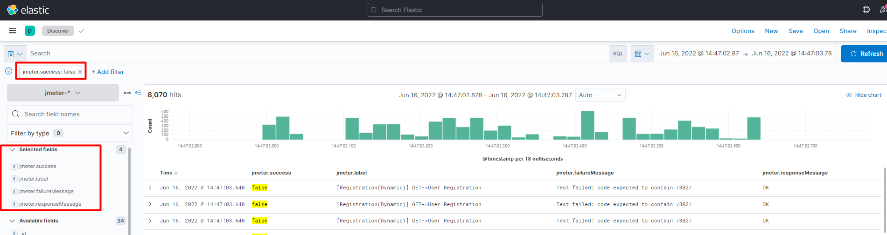

# JMeter - ELK stack integration with cache layer (Redis)

The goal of the project - share artifacts used to build integration. There are no custom plugins or extra coding that have been used.
The stack has been successfully tested and used while real-world projects. The topic is not new, but here you can find the JMeter board and configs (fur sure for not production usage, but with useful transformations and data mapping things at the same time).

<h3> 

Support my Ukrainian Family ❤️

 

</h3>

<h3>

Like what you see? 😍

 
   

</h3>

# Abbreviations
* JMeter — HTTP requests/load generator.
* Elasticsearch — the database to store the data.
* Filebeat — logs reader.
* Logstash — the processing engine.
* Redis — the cache engine.   
* Kibana — the engine to see boards, reports built of Elasticsearch data.

# Architecture vision
The solution allows you to build the ELK cluster and use such the architecture
to make results visualization, and reports even while high load testing. Why do we need Redis? – it’s a great cache engine to store data in the memory, you will be able to see the data on the board without lags.
Why we can do high load testing and store data from many JMeters (which can be independent servers without the cluster)?  - ELK and Redis are scalable solutions.

The simple schema:
1. JMeter writes results to the `results.jtl` file (JMeter output), coma separated file.
2. FIleBeat monitors the JMeter output and pushes the data to Redis.
3. Logstash performs steps:
   a. checks the Redis 
   b. takes the data if any
   c. transforms using grok rules
   d. pushes to ElasticSearch.
4. Kibana visualises the data from Elasticsearch.

# Artifacts
All config files of the tools have been collected in the project `etc` folder.
The JMeter `output.jtl` file transformation rules are described in the following [config file](https://github.com/mderevyankoaqa/jmeter-elk/blob/main/etc/logstash/conf.d/filter.conf).

 

# The results viewing 
Download the [JMeterBoard.ndjson](https://github.com/mderevyankoaqa/jmeter-elk/tree/main/kibana_board/JMeterBoard.ndjson) and upload it yor Kibana.Then you will be able to see the metrics like on the screen.
* The summary
   
  
* The response time with TPS
   
  
* The aggregated report with errors summary
  
  
# The errors analysis 
The ELK allows you to search and view any data you saved in ElasticSearch using `Discover`.
So you can select the index and set the appropriate filters to view errors.
   

